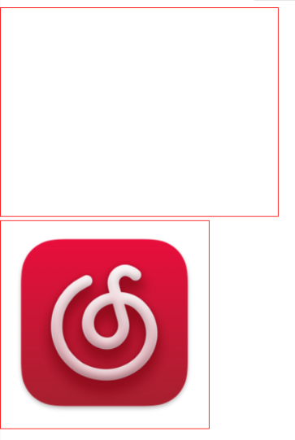

# 微信小程序开发速查手册

## ❇️基本组件

### 1. view

+ 普通视图区域
+ 类似于HTML中的div，是一个块级元素
+ 常用来实现页面的布局效果

快速解读：

1. `text` 是页面标签
2. `view` 是块级元素，用于布局页面
3. 其中第一个代码块是一个 `view父元素` 嵌套 `view子元素`

***

1. `wxss` 中区域范围 `container1 > container1 view > container1 view:nth-child(?)`
2. 其中 `container1 view:nth-child(?)` 是子类选择器，可以快速选择子类对象
3. 设置文本垂直居中，可以使用 `line-height: XXXpx;` 注意：垂直居中的行距需和view的高度一致
4. `display: flex;` 是用于实现横向布局的一种方式
5. `justify-content: space-around; `在行之前、行之间和行之后显示带有间隔的弹性项目

      

示例：

~~~html
<!--pages/list/list.wxml-->
<text></text>

<view class="container1">
  <view>A</view>
  <view>B</view>
  <view>C</view>
</view>
~~~

~~~css
/* pages/list/list.wxss */
.container1 view {
  width: 100px;
  height: 100px;
  text-align: center;
  line-height: 100px;
}

.container1 view:nth-child(1) {
  background-color: #23a8f2;
}

.container1 view:nth-child(2) {
  background-color: #00b26a;
}

.container1 view:nth-child(3) {
  background-color: #de5424;
}

.container1 {
  display: flex;
  justify-content: space-around;
}
~~~

 

 

### 2. scroll-view

+ 可滚动的视图区域
+ 常用来实现滚动列表效果

快速解读：

1. `scroll-veiw`用于实现页面内的滚动效果
2. 其中需要`scroll-x/y`来实现==横向或者是纵向滚动==的需求，需要手动开启

***

1. 其中 `.container1` 中的代码第一个用于确定该滚动页面的边界
2. 第二行代码用于确定该div盒子的宽度，若没有此代码，该元素将会占用一整行

 

3. 高度影响滚动的范围

 

示例：

~~~html
<!--pages/list2/list2.wxml-->
<text>scroll-view演示</text>

<scroll-view class="container1" scroll-y>
  <view>A</view>
  <view>B</view>
  <view>C</view>
</scroll-view>
~~~

~~~css
/* pages/list2/list2.wxss */
.container1 view {
  width: 100px;
  height: 400px;
  text-align: center;
  line-height: 100px;
}

.container1 view:nth-child(1) {
  background-color: #00b26a;
}
.container1 view:nth-child(2) {
  background-color: #ffbc04;
}
.container1 view:nth-child(3) {
  background-color: #007ab2;
}

.container1 {
  border: 1px solid red;
  width: 100px;
  height: 500px;
}
~~~

 

 

### 3. swiper 和 swiper-item

+ 轮播图容器组件 和 轮播图item组件

快速解读：

1. swiper是定义轮播图的一个容器，里面专门放置swiper-item等需要轮播的项目
2. 有几个轮播图就写几个`swiper-item`

***

1. `.item` 是定义颜色部分的CSS样式，100%是为了填充父元素 `swiper` 的高度

示例：

~~~html
<!--pages/list3/list3.wxml-->
<text>演示轮播图swiper和swiper-item</text>
<!-- 轮播图结构 -->
<swiper class="swiper-container">
  <!-- 第一个轮播图 -->
  <swiper-item>
    <view class="item">A</view>
  </swiper-item>
  <!-- 第二个轮播图 -->
  <swiper-item>
    <view class="item">B</view>
  </swiper-item>
  <swiper-item>
    <!-- 第三个轮播图 -->
    <view class="item">C</view>
  </swiper-item>
</swiper>
~~~

~~~css
/* pages/list3/list3.wxss */
.swiper-container {
  height: 150px;
}

.item {
  height: 100%;
  text-align: center;
  line-height: 150px;
}

swiper-item:nth-child(1) .item {
  background-color: skyblue;
}
swiper-item:nth-child(2) .item {
  background-color: lightgreen;
}
swiper-item:nth-child(3) .item {
  background-color: lightyellow;
}
~~~

 

 

#### 3.1 swiper 组件的常用属性

| 属性                   | 类型    | 默认值             | 说明                 |
| ---------------------- | ------- | ------------------ | -------------------- |
| indicator-dots         | boolean | false              | 是否显示面板指示点   |
| indicator-color        | color   | rgba( 0, 0, 0, .3) | 指示点颜色           |
| indicator-active-color | color   | #000000            | 当前选中的指示点颜色 |
| autoplay               | boolean | false              | 是否自动切换         |
| interval               | number  | 5000               | 自动切换时间间隔     |
| circular               | boolean | false              | 是否采用衔接滑动     |

使用方法：

直接写在 `swiper` 标签里面就行了

 

## 🤯内容基础组件

1. text
   + 文本组件
   + 类似于 HTML 中的 span 标签，是一个行内元素
2. rich-text
   + 富文本组件
   + 支持把 HTML 字符串渲染为 WXML 结构

 

### 1. text

通过 text 组件的 selector 属性，实现长按选中文本内容的效果：

~~~html
<!--pages/list4/list4.wxml-->
<text>text组件演示</text>

<view>
  手机号支持长按选中的效果
  <!-- 注意：如果要产生长按选中的效果，需要加上selectable属性 -->
  <text selectable="true">1234567890</text>
</view>
~~~

 

 

### 2. rich-text

通过 rich-text 组件的 nodes 属性节点，把 HTML 字符串渲染为对应的 UI 结构：

~~~html
<rich-text nodes="<h1 style='color:red;'>rich-text 演示<h1>"></rich-text>
~~~

 

 

## 👾其他常用组件

1. button
   + 按钮组件
   + 功能比 HTML 中的 button 按钮丰富
   + 通过 open-type 属性可以调用微信提供的各种功能（客服、转发、获取用户授权、获取用户信息等）

2. image
   + 图片组件
   + image 组件默认宽度约为 300px、高度约为 240px

3. navigator
   + 页面导航组件
   + 类似于 HTML 中的 a 链接

 

### 1. button

示例：

~~~html
<!--pages/list/list.wxml-->
<rich-text nodes="<h3 style='color: #42a5f5'>button按钮基本使用<h3>"></rich-text>

<button>默认按钮</button>
<button type="primary">主色调按钮</button>
<button type="warn">警告按钮</button>

<button size="mini">默认小按钮</button>
<button type="primary" size="mini">主色调小按钮</button>
<button type="warn" size="mini">警告小按钮</button>

<button size="mini" plain="true">默认镂空小按钮</button>
<button type="primary" size="mini" plain="true">主色调镂空小按钮</button>
<button type="warn" size="mini" plain="true">警告镂空小按钮</button>
~~~

 

 

### 2. image

image 组件默认宽度约为 300px、高度约为 240px

image 组件的 mode 属性用来指定图片的 裁剪和缩放 模式，常用的 mode 属性值如下：

| mode 值     | 说明                                                         |
| ----------- | ------------------------------------------------------------ |
| scaleToFill | （默认值）缩放模式，==不保持横纵比缩放图片==，使图片的宽高完全拉伸至 ==填满 image 元素== |
| aspectFit   | 缩放模式，==保持横纵比缩放图片==，==使图片的长边能完全显示出来==。也就是说，可以完整地将图片显示出来 |
| aspectFill  | 缩放模式，==保持横纵比缩放图片==，==只保证图片的短边能完全显示出来==。也就是说，图片通常只在水平或垂直方向使完整的，另一个方向将会发生截取 |
| widthFix    | 缩放模式，==宽度不变，高度自动变化==，保持原图宽高比不变     |
| heightFix   | 缩放模式，==高度不变，宽度自动变化==，保持原图宽高比不变     |

saleToFill：拉伸至填满整个区域

 

***

aspectFit：完整显示图片

 

***

aspectFill：填充区域而不拉伸

 

***

widthFix：宽度固定，高度不固定

  

***

heightFix：高度固定，宽度不固定

 

***

 

## 🏅小程序API

1. 事件监听类API
   + 以 on 开头，用来监听某些事件的触发
   + 举例：wx.onWindowResize(funtion callback)监听窗口尺寸变化的事件
2. 同步API
   + 特点1：以 Sync 结尾的API都是同步类 API
   + 特点2：同步 API 的执行结果，可以通过函数返回值直接获取，如果执行出错会抛出异常
   + 举例：wx.setStrageSync('key', 'value') 向本地存储中写入内容
3. 异步API
   + 特点：类似于 jQuery 中的 `$.ajax(options)函数`，需要通过 success，fail，complete接收调用的结果
   + 举例：wx.request()发起网络数据请求，通过 success 回调函数接收数据
